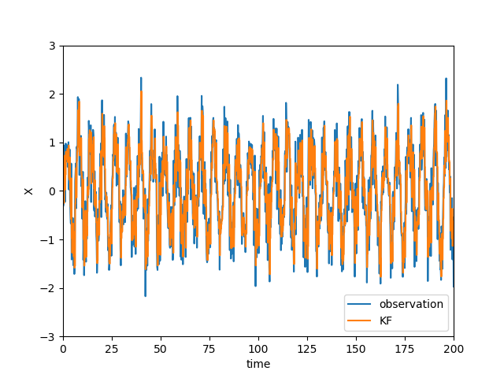

# aoi_chaos

のーふぉんさん作、「琴葉葵の混沌解析」で紹介されていたデータ同化シミュレーションを、Rustに翻訳した支援コードです。

## Contents

### sin_gen

「琴葉葵の混沌解析 part2」のコードです。

以下のコマンドから実行できます（Windows10で検証済み）

```PS
../aoi_chaos> cargo run --release --example sin_gen --features intel-mkl 
```



### part3 以降

作成中です…